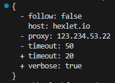
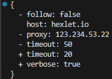
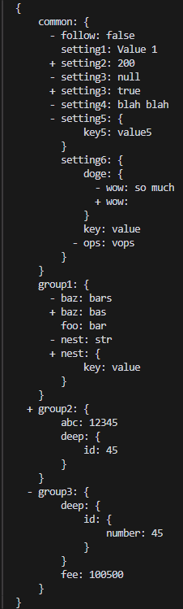
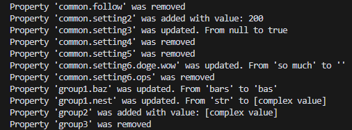

### Hexlet tests and linter status:
[](https://github.com/Ahtoxa83/frontend-project-46/actions)


Gendiff.
Work with JSON and YML.

### Install
```
npm i
```
### Usage
Help:
```
gendiff -h
```
Version:
```
gendiff -V
```
Compare:
```
gendiff <path to file1> <path to file2>
```
Select the output format:
```
gendiff --format plain <path to file1> <path to file2>
```
  
## Example

## Comparison of flat files JSON


## Comparison of flat files YAML


## Comparison of nested files JSON


## Plain formatter


## JSON formatter
